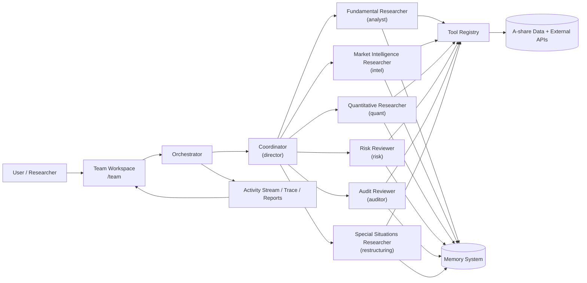

# AlphaTeam

> **构建资本市场可信、可控、可回溯的量化投研开放架构** > *A Trustworthy, Controllable, and Traceable Framework for Financial Intelligence.*

---

## 💡 核心理念 (Core Philosophy)

在充满噪声的资本市场，我们不追求单一模型的“神谕”，而追求投研过程的**“确定性”**。

AlphaTeam 旨在解决传统 AI 投研中“流程黑盒、责任不清、不可审计”的痛点，将投研逻辑从“只看结果”转向 **“过程可解释、动作可约束、状态可追踪”**。

---

## 🚀 核心特性 (Key Features)

| 特性 | 描述 |
| :--- | :--- |
| **🛡️ 可信 (Reliable)** | 独创**“因果假设链”**推理模式，强制要求“证据-结论”一一对应，从底层逻辑拒绝 AI 幻觉。 |
| **🎮 可控 (Controllable)** | 引入**反方审计 (Adversarial Audit)** 与风险复核机制，确保每一项投资建议都经过严苛的逻辑挑战。 |
| **🔍 可回溯 (Traceable)** | 全链路 **Activity Stream** 与记忆中心，每一秒的决策依据、工具调用和原始数据均可审计还原。 |
| **🧬 可进化 (Evolving)** | 深度适配 **A-share first** 约束场景，支持多智能体在复杂实战反馈中实现自我进化与迭代。 |

---

## 🛠️ 系统架构 (Architecture)

AlphaTeam 并非简单的问答机器人，而是一套**面向投研的工业级底座**：

### 1. 多智能体协作层 (Multi-Agent Collaboration)
研究、情报、风控、审计职责分离，深度模拟现实金融机构的投研流水线，实现真正的专业化分工。

### 2. 工具治理中心 (Tool Governance)
对 API 调用与数据检索进行严格审计，确保数据源合规、调用链透明，且研究结果具备 100% 可重现性。

### 3. 可视化工作流 (Visual Workflow)
通过直观的决策链路展示，将量化分析的逻辑完全“白盒化”，让每一个策略细节都清晰可见。

---

## 📅 路线图 (Roadmap)
- [x] 核心框架设计
- [x] 多智能体协作协议
- [ ] A股实时数据接入
- [ ] 自动化回测系统集成

---

> **Mission:** AlphaTeam 不替代人类的投资判断，我们致力于为全球投研团队提供一套**可扩展、可验证、具备金融直觉**的数字基础设施。

## Architecture at a Glance



## Why This is Different from Traditional Architectures

| 维度 | 传统单模型/规则式架构 | AlphaTeam |
|---|---|---|
| 执行范式 | 单体推理或静态规则链 | 多角色协作 + 编排器驱动 |
| 可控性 | 控制面零散，难以统一时限、审批与中断策略 | 支持工作流配置、超时治理、全局中止与角色边界约束 |
| 可回溯性 | 常见“结果可见，过程不可见” | 支持活动流、Trace、报告归档 |
| 合规与审计证据 | 缺少统一审计接口，难形成检查闭环 | 提供工具目录、源码查看与审查接口，保留可核验证据链 |
| 记忆透明度 | 记忆机制常不可视 | 提供 `memory_center` 可视化接口 |
| 工具可信度 | 工具调用审计弱 | 提供工具目录、源码查看、审查接口 |
| 可视化程度 | 多为文本面板 | 3D 工作流场景 + 实时状态展示 |
| 架构演进 | 插件扩展成本高 | 角色、工具、技能均可扩展 |

## Role Taxonomy (Academic Naming)

| Runtime ID | Runtime Name | Academic Role |
|---|---|---|
| `director` | 决策总监 | Coordinator |
| `analyst` | 投资分析师 | Fundamental Researcher |
| `intel` | 市场情报员 | Market Intelligence Researcher |
| `quant` | 量化策略师 | Quantitative Researcher |
| `risk` | 风控官 | Risk Reviewer |
| `auditor` | 反思审计员 | Audit Reviewer |
| `restructuring` | 资产重组专家 | Special Situations Researcher |

## Architecture Spec

完整规格文档见 [docs/ARCHITECTURE.md](docs/ARCHITECTURE.md)。以下为摘要：

- Orchestration Layer: `orchestrator` 与 `portfolio_scheduler` 驱动研究与组合周期。
- Agent Runtime Layer: `agent_registry` 管理角色模型路由、状态与停止控制。
- Tool and Data Layer: `tool_registry` 约束工具调用入口与参数模式。
- Memory and Governance Layer: 记忆系统、活动总线、Trace、工具审计共同构成治理闭环。
- Interface Layer: `/team` 统一交互与可视化入口，支持 3D 协作场景。

## Core Modules

- App Entry: `AlphaFin/app.py`
- Team API and Routes: `AlphaFin/ai_team/routes.py`
- Orchestrator: `AlphaFin/ai_team/core/orchestrator.py`
- Portfolio Scheduler: `AlphaFin/ai_team/core/portfolio_scheduler.py`
- Agent Registry: `AlphaFin/ai_team/core/agent_registry.py`
- Tool Registry: `AlphaFin/ai_team/core/tool_registry.py`
- Memory System: `AlphaFin/ai_team/core/memory.py`
- Team Frontend: `AlphaFin/ai_team/templates/ai_team.html`
- Team 3D Scene: `AlphaFin/ai_team/static/js/three_scene.js`
- DB Build Script: `AlphaFin/scripts/build_db.py`

## Quick Start

```bash
python3 -m venv .venv
source .venv/bin/activate
pip install -r requirements.txt
```

配置环境变量（参考 `.env.example`），至少设置：

- `SECRET_KEY`
- `TUSHARE_TOKEN`
- `QWEN_API_KEY`
- `MOONSHOT_API_KEY`（建议，用于联网搜索链路）

启动服务：

```bash
python3 AlphaFin/app.py
```

访问入口：

- Team Workspace: `http://127.0.0.1:5002/team`

## Data Bootstrap

默认数据库目录为 `data/db`（可通过 `ALPHAFIN_DB_ROOT` 覆盖）。

```bash
# 快速模式（推荐，近 1 年）
python3 -m AlphaFin.scripts.build_db --mode quick

# 全量模式
python3 -m AlphaFin.scripts.build_db --mode full

# 全量 + 财务指标
python3 -m AlphaFin.scripts.build_db --mode full --include-fina
```

## A-share First Constraints

当前版本优先服务 A 股投研语境：

- 中国市场时钟语义与交易时段约束。
- 本地数据链路可控、可重建。
- 风控与复核环节默认前置。

项目可扩展至其他市场，但需要新增数据适配、时钟规则与交易语义层。

## Observability and Governance APIs

| 能力 | API |
|---|---|
| 活动流（SSE） | `/api/team/activity` |
| 运行链路 Trace | `/api/team/trace/runs`, `/api/team/trace/<run_id>` |
| 记忆中心 | `/api/team/memory_center` |
| 工具目录与源码审查 | `/api/team/tools_audit/catalog`, `/api/team/tools_audit/source`, `/api/team/tools_audit/review` |
| 生命周期控制 | `/api/team/module/start`, `/api/team/module/stop`, `/api/team/stop_all_work` |
| 超时治理 | `/api/team/session/<session_id>/overtime` |

## Security and Data Governance

- 仓库不包含本地运行数据库、历史会话、运行轨迹等私有数据。
- 通过 `.gitignore` 屏蔽 `*.db`、trace、报告等运行态产物。
- API key 与 token 统一由环境变量注入，不在代码中明文提交。

推送前建议执行：

```bash
rg -n "sk-[A-Za-z0-9]{16,}|TUSHARE_TOKEN\\s*=\\s*'|API_KEY\\s*=\\s*'" AlphaFin
```

## Optional External Dependencies

以下指标依赖外部目录，不属于本仓库主体：

- `ind_21_agent_strategy` 依赖 `STOCKAGENT_DIR`（默认 `third_party/stockagent`）
- `ind_22_fin_evolver` 依赖 `FIN_EVOLVER_DIR`（默认 `third_party/Evolve_Fin/script`）

缺少上述目录不会阻塞 AlphaTeam 主流程，但对应指标不可用。

## Non-goals

- 本项目不保证投资收益或胜率。
- 本项目不是自动实盘交易系统。
- 本项目输出内容不构成投资建议。

## Citation

若你在研究或工程工作中使用 AlphaTeam，建议按软件仓库方式引用：

```bibtex
@software{alphateam2026,
  title   = {AlphaTeam: A Multi-Agent Open Architecture for Stock Research and Decision Support},
  author  = {AlphaTeam Contributors},
  year    = {2026},
  url     = {https://github.com/jackyideal/AlphaTeam}
}
```
